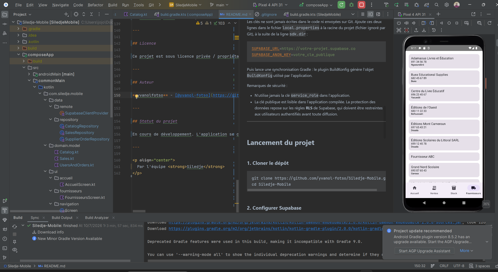
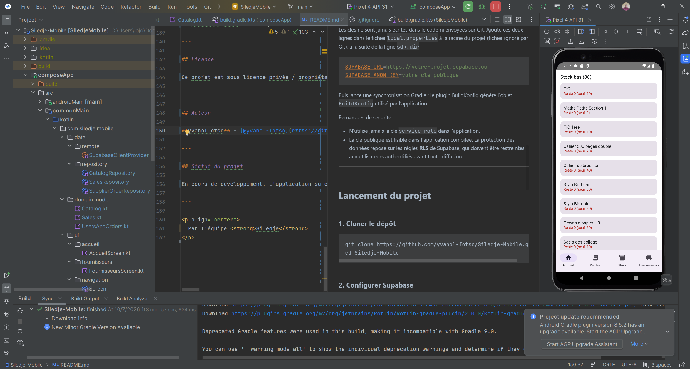
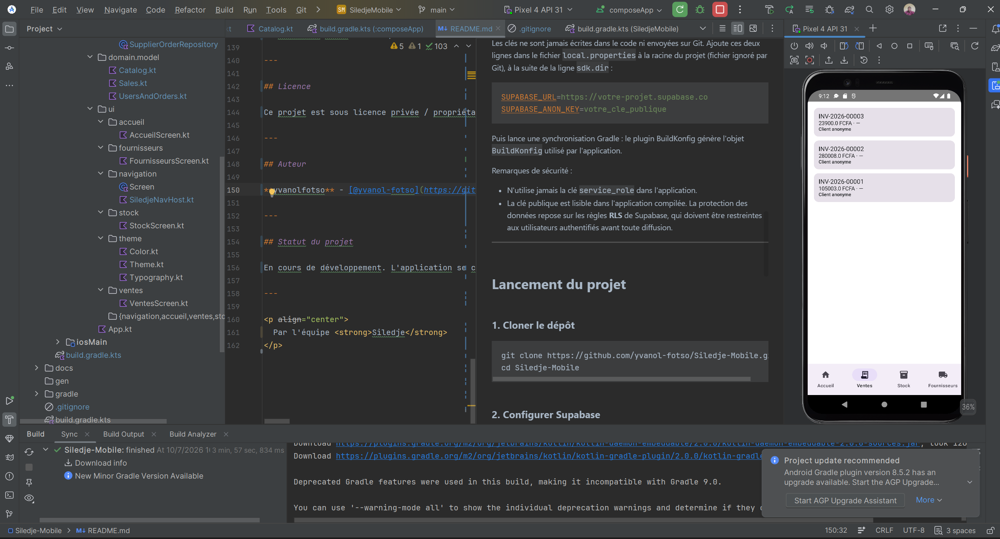

# Siledje-Mobile

**Siledje-Mobile** est l'application mobile officielle du projet **Siledje**, développée en **Kotlin Multiplatform (KMP)** avec **Compose Multiplatform**. Elle permet de consulter le stock, les ventes et les fournisseurs depuis un téléphone Android (et iOS), à partir d'un codebase partagé, avec les mêmes données que l'application desktop.

---

## Captures d'écran

<p align="center">
  
  
  
</p>

---

## Fonctionnalités principales

- **Multiplateforme** : interface et logique métier partagées avec Compose Multiplatform.
- **Données en direct** : lecture du stock, des ventes et des fournisseurs via Supabase, le même backend que l'application desktop.
- **Interface moderne** : navigation par onglets (Accueil, Ventes, Stock, Fournisseurs) en Material 3.
- **Codebase unifié** : une seule base de code pour Android et iOS.

---

## Stack technique

- **Langage** : Kotlin (100 %)
- **UI** : Compose Multiplatform (Material 3)
- **Architecture** : Kotlin Multiplatform (KMP), repositories + ViewModels
- **Backend** : Supabase (PostgREST, Auth) via `supabase-kt`
- **Réseau et sérialisation** : Ktor, kotlinx.serialization, kotlinx-datetime
- **Build** : Gradle (`build.gradle.kts`, `settings.gradle.kts`), BuildKonfig pour les clés
- **Cibles** : Android et iOS

---

## Structure du projet

```text
Siledje-Mobile/
├── composeApp/              # Module principal de l'application
│   ├── src/
│   │   ├── commonMain/      # Code partagé (UI, domaine, accès aux données)
│   │   ├── androidMain/     # Code spécifique Android
│   │   └── iosMain/         # Code spécifique iOS
│   └── build.gradle.kts
├── docs/
│   └── screenshots/         # Captures d'écran du README
├── gradle/
│   └── wrapper/             # Wrapper Gradle
├── build.gradle.kts         # Configuration Gradle principale
├── settings.gradle.kts      # Configuration des modules
├── gradlew / gradlew.bat    # Scripts d'exécution Gradle
├── .gitignore               # Fichiers ignorés par Git
└── README.md
```

---

## Prérequis

- **JDK 17 ou 21** (pas le JDK 25, incompatible avec Gradle 8.7)
- **Android Studio** récent, avec le plugin **Kotlin Multiplatform**
- **Xcode** (macOS uniquement) pour compiler et lancer la partie iOS
- Un projet **Supabase** actif (les projets du plan gratuit se mettent en pause après inactivité)

---

## Configuration de Supabase

Les clés ne sont jamais écrites dans le code ni envoyées sur Git. Ajoute ces deux lignes dans le fichier `local.properties` à la racine du projet (fichier ignoré par Git), à la suite de la ligne `sdk.dir` :

```properties
SUPABASE_URL=https://votre-projet.supabase.co
SUPABASE_ANON_KEY=votre_cle_publique
```

Puis lance une synchronisation Gradle : le plugin BuildKonfig génère l'objet `BuildKonfig` utilisé par l'application.

Remarques de sécurité :

- N'utilise jamais la clé `service_role` dans l'application.
- La clé publique est lisible dans l'application compilée. La protection des données repose sur les règles **RLS** de Supabase, qui doivent être restreintes aux utilisateurs authentifiés avant toute diffusion.

---

## Lancement du projet

### 1. Cloner le dépôt

```bash
git clone https://github.com/yvanol-fotso/Siledje-Mobile.git
cd Siledje-Mobile
```

### 2. Configurer Supabase

Voir la section précédente.

### 3. Exécuter sur Android

Depuis Android Studio, sélectionne la configuration `composeApp` et un appareil ou un émulateur, puis clique sur Run. En ligne de commande :

```bash
./gradlew :composeApp:assembleDebug
```

### 4. Exécuter sur iOS

Sur macOS, ouvre le projet dans Android Studio et choisis le runner iOS, ou ouvre le projet Xcode généré pour lancer l'application depuis Xcode.

---

## Tests

```bash
./gradlew test
```

---

## Contribution

1. Fork du projet
2. Création d'une branche :
```bash
   git checkout -b feature/NouvelleFonctionnalite
```
3. Commit des modifications :
```bash
   git commit -m "feat: description de la fonctionnalité"
```
4. Push vers la branche :
```bash
   git push origin feature/NouvelleFonctionnalite
```
5. Ouverture d'une Pull Request

---

## Licence

Ce projet est sous licence privée / propriétaire. Tous droits réservés par l'équipe **Siledje**.

---

## Auteur

**yvanolfotso** - [@yvanol-fotso](https://github.com/yvanol-fotso)

---

## Statut du projet

En cours de développement. L'application se connecte à Supabase et affiche le stock, les ventes et les fournisseurs. L'authentification et la sécurisation des accès restent à mettre en place.

---

<p align="center">
  Par l'équipe <strong>Siledje</strong>
</p>